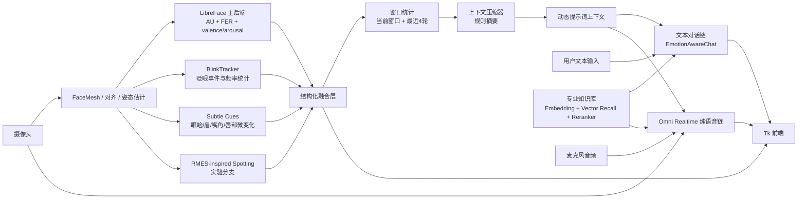

# 项目架构、使用说明与提示词注入说明

## 1. 项目目标

这是一个面向中文心理陪伴场景的多模态对话系统，核心目标不是单纯“做聊天”，而是把：

- 本地视觉情绪分析
- 细粒度表情线索与眨眼统计
- 微表情实验支路
- 专业知识库检索
- 实时语音对话

融合进同一条交互链路中，让模型在多轮对话里既能自然聊天，也能更稳地利用本地结构化信号调节语气、节奏和回应强度。

## 2. 整体架构



## 3. 核心功能

### 3.1 文本聊天模式

- 使用 DashScope 文本模型进行流式回复。
- 在发起一次文本回复前，动态注入：
  - 本地情绪摘要
  - 情绪变化队列
  - 专业知识库检索片段

### 3.2 纯语音模式

- 使用 Omni Realtime 做实时语音对话。
- 同时输入：
  - 麦克风音频
  - 摄像头原始帧
  - 本地结构化视觉摘要
  - 命中的知识库片段
- 以低频 `session.update` 的方式更新运行时 instructions。

### 3.3 本地视觉分析

- 默认主后端为 `LibreFace`。
- 输出不再只依赖 7 类离散情绪，而是更偏向：
  - `valence`
  - `arousal`
  - `confidence`
  - `AU` 强度
  - `blink` 指标
  - `subtle cues`

### 3.4 窗口统计

窗口定义：

- 语音模式：从上一轮模型开始播放，到下一轮用户说完并触发回复开始播放之间。
- 文本模式：从上一轮回复显示完成，到下一轮用户提交并开始生成之间。

统计内容：

- 当前窗口统计
- 最近 4 轮滚动统计
- 趋势、斜率、均值、标准差、眨眼变化、主导 affect 分布

### 3.5 RMES-inspired 微表情实验支路

- 当前不是主线。
- 已做工程化接入，用于 spotting。
- 若后续验证效果足够好，可再进入主线融合与 Omni 注入。

## 4. 创新点

### 4.1 多层级 affect 表达

不是只输出一个“开心/难过”的离散标签，而是把：

- 离散情绪
- `valence/arousal`
- `AU`
- `blink`
- `subtle cues`

同时保留，形成更适合多轮对话使用的结构化 affect 表达。

### 4.2 窗口化上下文而非单帧判断

不是把单帧识别结果直接喂给模型，而是先做：

- 当前窗口统计
- 最近 4 轮滚动摘要
- 规则压缩

再注入模型，减少误判和过度解读。

### 4.3 文本与语音共享同一套本地结构化上下文

文本模式和纯语音模式都可以利用同一套视觉结构化数据，而不是各自分裂成两条完全独立的逻辑。

### 4.4 专业知识库与本地 affect 信号共同参与对话调度

知识库不是独立问答模式，而是作为动态背景资料插入多轮对话流程，和情绪/微表情信号一起影响回答。

## 5. 技术栈

### 5.1 前端 / UI

- `Tkinter`
- `Pillow`

### 5.2 视觉与情绪分析

- `OpenCV`
- `MediaPipe Face Mesh`
- `LibreFace`
- 自定义 `BlinkTracker`
- 自定义 `RMES-inspired` spotting

### 5.3 语音与大模型

- DashScope / Qwen
- `qwen-plus-latest`
- `qwen3-omni-flash-realtime`
- `qwen3-asr-flash-realtime`
- `sounddevice`

### 5.4 知识库

- `SQLite`
- DashScope Embedding
- DashScope Reranker

## 6. 使用说明

### 6.1 启动

在 `hsemotion_tk` 环境中运行：

```powershell
conda activate hsemotion_tk
cd "C:\Users\Administrator\Documents\codex\competition\新建文件夹\新建文件夹\情感分析项目0.0.2"
python -m hsemotion_ui
```

### 6.2 文本模式

1. 进入主界面后，默认会显示欢迎语。
2. 可先启动本地情绪监测。
3. 输入文本后发送，系统会在后台拼接动态上下文后请求模型。

### 6.3 纯语音模式

1. 点击“进入纯语音对话”。
2. 模型会接收语音、视频和结构化视觉摘要。
3. 如果开启专业知识库，系统会在一轮用户转写完成后再做知识库检索与注入。

### 6.4 专业知识库

- 勾选“启用专业知识库”。
- 支持 `auto` 与 `force` 两种模式。
- `force`：每轮强制检索。
- `auto`：先判断问题是否需要专业知识库，再决定是否检索。

## 7. 交给 AI 的提示词与注入数据

## 7.1 文本模式提示词

文本模式的基础系统提示词源码位置：

- [prompts.py](/C:/Users/Administrator/Documents/codex/competition/新建文件夹/新建文件夹/情感分析项目0.0.2/hsemotion_llm/prompts.py#L4)

文本模式会动态拼接三类上下文：

- 情绪摘要：[prompts.py](/C:/Users/Administrator/Documents/codex/competition/新建文件夹/新建文件夹/情感分析项目0.0.2/hsemotion_llm/prompts.py#L12)
- 情绪变化队列：[prompts.py](/C:/Users/Administrator/Documents/codex/competition/新建文件夹/新建文件夹/情感分析项目0.0.2/hsemotion_llm/prompts.py#L22)
- 知识库片段：[prompts.py](/C:/Users/Administrator/Documents/codex/competition/新建文件夹/新建文件夹/情感分析项目0.0.2/hsemotion_llm/prompts.py#L32)

文本模式拼接入口：

- [chat_orchestrator.py](/C:/Users/Administrator/Documents/codex/competition/新建文件夹/新建文件夹/情感分析项目0.0.2/hsemotion_llm/chat_orchestrator.py#L94)
- [chat_orchestrator.py](/C:/Users/Administrator/Documents/codex/competition/新建文件夹/新建文件夹/情感分析项目0.0.2/hsemotion_llm/chat_orchestrator.py#L100)

### 7.1.1 文本模式基础系统提示词

当前有效设计可概括为：

```text
你是一个用于日常聊天的中文对话伙伴，风格自然、像真人、不带明显 AI 腔。
你可以根据内部信号调整语气、节奏和回应强度，但默认不要直接提到内部信号。
如果用户明确问起情绪信号，可以用生活化方式解释，不报底层原始数值。
默认中文输出，优先口语化、简短、流式自然。
```

### 7.1.2 文本模式动态注入示例

```text
【内部信号：本地情绪摘要】
这是一份来自本地视觉链路的粗略 affect 参考，重点关注 valence、arousal 和 confidence。
当前=valence=-0.31(偏负向)，arousal=0.42(中)，confidence=0.58；dominant=sad

【内部信号：情绪变化队列】
最近几轮里出现了明显回落和波动增大的片段，默认不要对用户直接复述。

【内部参考资料】
1. (WHO-MSD-MER-16.2-chi.pdf p.12 / chunk 18) ...
2. (mhgap-chi(OCR).pdf p.43 / chunk 66) ...
```

## 7.2 纯语音模式提示词

纯语音模式基础配置位置：

- Omni 通用 instructions：[config.py](/C:/Users/Administrator/Documents/codex/competition/新建文件夹/新建文件夹/情感分析项目0.0.2/hsemotion_llm/config.py#L77)
- 纯语音短答 instructions：[config.py](/C:/Users/Administrator/Documents/codex/competition/新建文件夹/新建文件夹/情感分析项目0.0.2/hsemotion_llm/config.py#L81)

运行时拼接入口：

- `conv.update_session(...)`：[omni_realtime.py](/C:/Users/Administrator/Documents/codex/competition/新建文件夹/新建文件夹/情感分析项目0.0.2/hsemotion_llm/speech/omni_realtime.py#L135)
- 构建 runtime instructions：[omni_realtime.py](/C:/Users/Administrator/Documents/codex/competition/新建文件夹/新建文件夹/情感分析项目0.0.2/hsemotion_llm/speech/omni_realtime.py#L430)
- 定时刷新注入：[omni_realtime.py](/C:/Users/Administrator/Documents/codex/competition/新建文件夹/新建文件夹/情感分析项目0.0.2/hsemotion_llm/speech/omni_realtime.py#L454)
- 外部知识更新入口：[omni_realtime.py](/C:/Users/Administrator/Documents/codex/competition/新建文件夹/新建文件夹/情感分析项目0.0.2/hsemotion_llm/speech/omni_realtime.py#L479)

### 7.2.1 纯语音模式提示词设计

```text
你是一个实时全模态情绪陪伴助手。
充分利用语音语气、用户说话节奏和摄像头画面中的表情线索，自然、直接地回应。
优先短句、口语化、低延迟，不要机械复述检测结果。

当前是纯语音对话。
请尽量短答：默认 1 到 2 句，优先一句话说完。
除非用户明确追问或要求展开，否则不要长解释、不要分点、不要铺垫。
```

### 7.2.2 纯语音模式注入数据示例

```text
下面是本地视觉链路给出的结构化参考信号。它比原始视频更稳定，但也只是粗略参考；
优先用它来调整语气、回应强度和节奏，不要逐字复述。

[本地结构化情绪上下文]
后端=libreface(LibreFace AU/FER 主后端)
当前窗口#8: valence_mean=-0.26, arousal_mean=0.38, confidence_mean=0.57, frontal_mean=0.82
当前窗口blink: count=3, rate=15.6/min, ibi=3.88s
当前窗口dominant_distribution={'sad': 0.42, 'neutral': 0.31, 'fear': 0.12}
当前窗口top_aus=[('AU15', 1.82), ('AU01', 1.44), ('AU04', 1.26)]
当前窗口subtle_top=[{'name': 'mouth_flatten', 'strength': 0.63}, {'name': 'lip_press', 'strength': 0.58}]
最近4窗口: valence_mean=-0.19, valence_slope=-0.08, arousal_mean=0.41, arousal_slope=+0.03, confidence_mean=0.55
最近4窗口blink_rate_mean=13.2/min, blink_delta_current_vs_baseline=+2.40
[/本地结构化情绪上下文]
```

如果本轮命中了专业知识库，还会追加：

```text
下面是本轮用户话题命中的专业知识库片段，仅在相关时自然吸收，不要逐字照搬：
1. (WHO-MSD-MER-16.4-chi.pdf p.9 / chunk 12) ...
2. (9789240003910-chi.pdf p.31 / chunk 57) ...
```

## 8. 结构化数据来源与位置

### 8.1 结构化快照定义

- [structured.py](/C:/Users/Administrator/Documents/codex/competition/新建文件夹/新建文件夹/情感分析项目0.0.2/hsemotion_llm/emotion/structured.py#L137)

### 8.2 结构化文本格式化

- 当前窗口格式化：[structured.py](/C:/Users/Administrator/Documents/codex/competition/新建文件夹/新建文件夹/情感分析项目0.0.2/hsemotion_llm/emotion/structured.py#L305)
- 最近窗口格式化：[structured.py](/C:/Users/Administrator/Documents/codex/competition/新建文件夹/新建文件夹/情感分析项目0.0.2/hsemotion_llm/emotion/structured.py#L329)
- 紧凑上下文化输出：[structured.py](/C:/Users/Administrator/Documents/codex/competition/新建文件夹/新建文件夹/情感分析项目0.0.2/hsemotion_llm/emotion/structured.py#L365)

### 8.3 视觉跟踪器输出入口

- 跟踪器定义：[visual_tracker.py](/C:/Users/Administrator/Documents/codex/competition/新建文件夹/新建文件夹/情感分析项目0.0.2/hsemotion_llm/emotion/visual_tracker.py#L30)
- 开启新窗口：[visual_tracker.py](/C:/Users/Administrator/Documents/codex/competition/新建文件夹/新建文件夹/情感分析项目0.0.2/hsemotion_llm/emotion/visual_tracker.py#L159)
- 获取结构化信号：[visual_tracker.py](/C:/Users/Administrator/Documents/codex/competition/新建文件夹/新建文件夹/情感分析项目0.0.2/hsemotion_llm/emotion/visual_tracker.py#L183)
- 获取当前窗口文本：[visual_tracker.py](/C:/Users/Administrator/Documents/codex/competition/新建文件夹/新建文件夹/情感分析项目0.0.2/hsemotion_llm/emotion/visual_tracker.py#L189)
- 获取最近 4 轮文本：[visual_tracker.py](/C:/Users/Administrator/Documents/codex/competition/新建文件夹/新建文件夹/情感分析项目0.0.2/hsemotion_llm/emotion/visual_tracker.py#L195)
- 获取 RMES 调试文本：[visual_tracker.py](/C:/Users/Administrator/Documents/codex/competition/新建文件夹/新建文件夹/情感分析项目0.0.2/hsemotion_llm/emotion/visual_tracker.py#L201)

## 9. 知识库链路位置

### 9.1 检索器

- [retriever.py](/C:/Users/Administrator/Documents/codex/competition/新建文件夹/新建文件夹/情感分析项目0.0.2/hsemotion_llm/rag/retriever.py#L37)
- 构建 snippets：[retriever.py](/C:/Users/Administrator/Documents/codex/competition/新建文件夹/新建文件夹/情感分析项目0.0.2/hsemotion_llm/rag/retriever.py#L43)
- 构建 snippets + hits：[retriever.py](/C:/Users/Administrator/Documents/codex/competition/新建文件夹/新建文件夹/情感分析项目0.0.2/hsemotion_llm/rag/retriever.py#L47)
- 是否应检索：[retriever.py](/C:/Users/Administrator/Documents/codex/competition/新建文件夹/新建文件夹/情感分析项目0.0.2/hsemotion_llm/rag/retriever.py#L60)

### 9.2 UI 触发位置

- 文本模式构建 RAG 片段：[tk_app.py](/C:/Users/Administrator/Documents/codex/competition/新建文件夹/新建文件夹/情感分析项目0.0.2/hsemotion_ui/tk_app.py#L384)
- 纯语音模式构建 RAG 片段与 hit_count：[tk_app.py](/C:/Users/Administrator/Documents/codex/competition/新建文件夹/新建文件夹/情感分析项目0.0.2/hsemotion_ui/tk_app.py#L394)
- 纯语音模式把知识库注入 Omni：[tk_app.py](/C:/Users/Administrator/Documents/codex/competition/新建文件夹/新建文件夹/情感分析项目0.0.2/hsemotion_ui/tk_app.py#L1184)
- UI 知识库状态显示：[tk_app.py](/C:/Users/Administrator/Documents/codex/competition/新建文件夹/新建文件夹/情感分析项目0.0.2/hsemotion_ui/tk_app.py#L1207)

## 10. 当前状态说明

- `LibreFace` 为主视觉后端。
- `RMES-inspired spotting` 目前是实验支路。
- `subtle cues`、窗口统计和结构化摘要已经进入文本模式与纯语音模式。
- 知识库在文本模式和纯语音模式都可注入，但纯语音模式是在用户一轮转写完成后再检索和更新。
